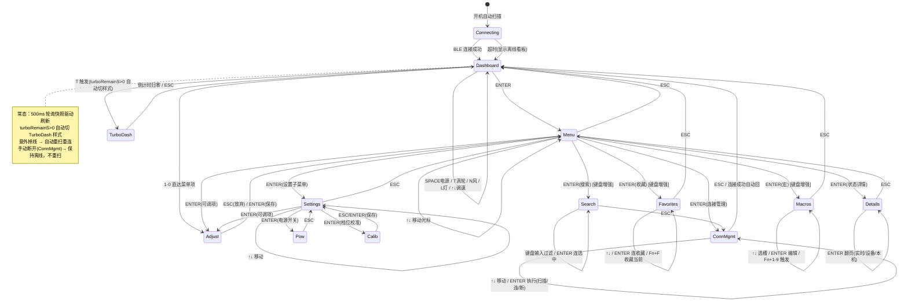

# Cardputer-Adv 风扇遥控器 · 交互设计稿（v0.1 评审稿）

> 状态：**评审稿（v0.1）**。协议层（`lib/w96p`）与 BLE client 复用 StickS3 版，本设计只定义 Cardputer-Adv 的 UI/交互层，不改动 `lib/w96p`。
>
> 硬件输入盘点（KB + 实机印刷核实）：56 键 TCA8418 键盘（4×14），方向键簇 `;↑` `,←` `.↓` `/→`（实机印上下左右，FN 色，多数固件默认即方向键）、`` ` ``=ESC、BACKSPACE=DEL、ENTER、Fn/Opt 修饰键；240×135 横屏（`setRotation(1)`）；**无 PSRAM**（ESP32-S3FN8）；BMI270 在场但本设计**放弃手势**；1750mAh 电池。
>
> 与 StickS3 版的核心差异：**输出来自键盘而非双键+手势**；因此删去 GESTURE 屏、连击互斥语义（双击/三击）、BtnB 点动 Turbo、体感参考系整套逻辑。新增键盘专属增强：收藏设备、连接名搜索、宏按键。

---

## 1. 设计原则

- **键盘优先，方向键导航**：列表/菜单用 `↑↓←→` 移动光标，ENTER 进入，`ESC`(`` ` ``) 回退，数字 `1-0` 直达常用项。
- **看板优先**：默认界面是只读状态看板，所有控制"多走一步"，杜绝误触。
- **动作键常驻**：看板态下 SPACE=电源、T=Turbo、N=自然风、L=灯光，最常用操作一键直达。
- **数据采信两原则**（沿用 StickS3 裁定，违反即设计错误）：
  1. 设备可换电池且固件未做电池记账 → 只呈现**电压与电流**，不做 SOC 推算、不显示累计 mWh/时长。
  2. 设备无温度传感器 → `tempC`/`coreTemp` 来自电源管理芯片非电池温度，**不采信、不呈现**。
- **中文渲染**：用 M5GFX 内置 `fonts::efontCN`（加粗 `efontCN_b`）；大字号数字用 Latin 字体（Font4/6/DejaVu），逐次 `setFont` 切换；真机过一遍缺字检查。

## 2. 屏幕架构（240×135 横屏）

```
┌──────────────────────────────────────────────┐  ← 顶栏状态条 (y 0..15, 高16)
│ W96P  ● 65%        3.95V -412mA    ●BLE绿/○灰 │
├──────────────────────────────────────────────┤
│                                                │
│            主内容区 (y 16..119, 高104)          │  ← 当前屏：看板/菜单/设置/连接/详情/收藏/搜索/宏
│                                                │
├──────────────────────────────────────────────┤  ← 底提示条 (y 120..135, 高15)
│ ↑↓调速 SPACE开关 T涡轮 N风 L灯 1-0菜单 ESC返回 │     ← 随屏变化
└──────────────────────────────────────────────┘
```
- 顶栏全局常驻：左=设备名+BLE 点；中=当前风速%；右=电池电压/电流；离线时整条降灰。
- 主区：单屏一态（看板是一个屏），由状态机切换；数值变化才重绘（脏标记）。
- 底提示条：上下文敏感，显示当前屏可用键（见各屏草案）。
- 横屏空间宽（240px ≈ 单行可排 2 列信息），看板用左仪表+右状态双栏；菜单/列表用单列左对齐 + 光标反白。

## 3. 状态机



## 4. 键盘映射总表（核心）

### 4.1 全局键（所有屏生效）

| 键 | 语义 | 备注 |
|---|---|---|
| `↑`(`;`) `↓`(`.`) `←`(`,`) `→`(`/`) | 光标移动 / 列表上下 / 看板调速 | 看板态 `↑↓`=风速±5% 步进（按住爬升） |
| `` ` ``（印 ESC） | 返回上一级 | 任意子屏→看板/上一级 |
| BACKSPACE（印 DEL） | 文本删除 / 返回 | 输入态删字；非输入态同 ESC |
| ENTER | 确认 / 进入子菜单 / 打开选中项 | |
| SPACE | 风扇电源开关 | 仅看板态 |
| `T` | Turbo 开关 | 仅看板态 |
| `N` | 自然风开关 | 仅看板态 |
| `L` | 灯光档位 +1 循环(0-4) | 仅看板态 |
| `1`-`0` | 菜单项直达热键 | 见 §5 映射；任意屏按数字跳对应项 |
| `Fn`+`1`-`9` | 触发宏槽 1-9 | 见 §7.3 |
| `Fn`+`F` | 收藏当前连接设备 | 见 §7.1 |
| `Fn`+`S` | 进入连接名搜索 | 见 §7.2 |

> **待真机核实**：方向键簇的精确 `getKey()` 返回值（库默认是否直接返回箭头语义，还是返回 `;`,`,`,`.`,`/` 字符需自行映射）。第一次烧录先打印每个键的 `getKey()`/`keysState()` 对照后再固化映射表。Fn 修饰键读 `status.fn` 后自行组合。

### 4.2 数字热键 → 菜单项映射（看板/任意屏按数字直达）

| 数字 | 跳转目标 | 动作 |
|---|---|---|
| `1` | 风速 | 进 ADJUST（步进±5%） |
| `2` | 定时 | 进 ADJUST（±30min，0=取消） |
| `3` | 自然风 | 切换 on/off |
| `4` | 灯光 | 档位+1 循环 |
| `5` | 设置 | 进设置子菜单 |
| `6` | 状态详情 | 进 DETAILS |
| `7` | 连接管理 | 进 CONN_MGMT |
| `8` | 收藏设备 | 进 FAVORITES [增强] |
| `9` | 搜索设备 | 进 SEARCH [增强] |
| `0` | 宏 | 进 MACROS [增强] |

## 5. 功能 → 按键路径（全功能对齐 StickS3）

| 功能 | 路径 | client API |
|---|---|---|
| 风扇开/关 | 看板 · SPACE | `setPower(0/1)` |
| Turbo 开/提前退出 | 看板 · `T` | `setTurbo(bool)` |
| 无级调速 | 看板 · `↑`/`↓` 步进 / 按住爬升 | `setSpeed(pct)` |
| 风速微调 | `1` → ENTER 保存 / `↑↓` 调 / ESC 放弃 | `setSpeed(pct)` |
| 定时关机 | `2` → `↑↓`(±30min) / ENTER 保存 | `setTimerMinutes(min)` |
| 自然风 | `3` 切换 | `setNatureWind(bool)` |
| 灯光档位 | `4` 循环 0-4 | `setLight(lv)` |
| 设置子菜单 | `5` 进入 | — |
| Turbo 时间/休眠延时/减档/BLE_SN | 设置 → 选中 → `↑↓`调 / ENTER 保存 | `setTurboTime` 等 |
| 电源开关(C_OUT/C_IN/C_HI) | 设置 → 电源开关 → `↑↓`选 / ENTER 翻 | `setPowSwitch` |
| 档位校准(4档转速) | 设置 → 档位校准 → `↑↓`选档/`↑↓`调 / ENTER 保存 | `setSpeedCalib` |
| 查看电池/电机/VBUS | 看板常驻（顶栏+主区右栏） | 快照字段 |
| 状态详情(实时/设备/本机) | `6` → ENTER 翻页 | 快照 + `readPowerConfig` |
| 扫描/连接/断开/重连 | `7` 连接管理 → `↑↓`选 / ENTER 执行 | `startScan`/`connectIndex`/`disconnect` |
| 收藏设备 [增强] | `8` → `↑↓`选 / ENTER 连 / `Fn+F` 收藏当前 | NVS 持久化 |
| 连接名搜索 [增强] | `9`(或 `Fn+S`) → 键盘输入过滤 / ENTER 连选中 | NVS + 扫描列表 |
| 宏按键 [增强] | `0` → `↑↓`选槽 / ENTER 编辑 / `Fn+1-9` 触发 | NVS 持久化 + 命令序列 |

**菜单项定义**（浏览顺序，`5` 设置进入后另有子菜单）：`风速 → 定时 → 自然风 → 灯光 → 设置 → 状态详情 → 连接管理 → 收藏 → 搜索 → 宏 → 返回`

## 6. UI 草案（横屏 240×135，setRotation(1)）

### 6.0 配色规范（复用 StickS3 §5.0 语义，RGB565）

| 颜色 | 语义 | 用例 |
|---|---|---|
| 绿 `0x07E0` | 正常/在线/开启 | BLE 在线点、开关 ON、充电中 |
| 深灰 `0x4208` | 关闭/无数据/提示 | off、"--"、底提示条、分隔线 |
| 青 `0x07FF` | 可调值/强调 | 风速数字、进度条、菜单当前值 |
| 橙 `0xFD20` | 警告/高能 | Turbo、电池<30%、到头提示 |
| 红 `0xF800` | 报警/错误 | 电机 BLOCK、电池<10%、BLE 掉线 |
| 白 `0xFFFF` | 常规数值正文 | 一般数据 |

### 6.1 状态看板（默认 / 离线）

```
┌────────────────────────────────────────────┐
│ W96P  ●         65%      3.95V -412mA       │  顶栏
├──────────────────────┬─────────────────────┤
│   ▓▓▓▓▓▓▓▓▓▓▓░░░░░░░ │ NAT:off  TMR:--     │
│   风速 65%           │ LGT:4    GEA:2      │
│   无级调速中…        │ BAT 3.95V -412mA    │  主区：左仪表+右状态
│   (按住↑↓爬升)        │ MOT  320mA  ok      │
│                      │ BUS 5.02V  DCHG     │
├──────────────────────┴─────────────────────┤
│ ↑↓调速 SPACE开关 T涡轮 N风 L灯 1-0菜单 ESC │  底提示
└────────────────────────────────────────────┘
```

### 6.2 Turbo 看板（turboRemainS>0 自动切）

```
┌────────────────────────────────────────────┐
│ **TURBO**  ●    02:47      3.90V -980mA    │
├──────────────────────┬─────────────────────┤
│   ▓▓▓▓▓▓▓▓▓▓▓▓▓▓░░░░░ │ BAT 3.90V -980mA   │
│   倒计时 02:47        │ MOT  810mA  5.1V   │
│   (橙底标题条)        │                     │
├──────────────────────┴─────────────────────┤
│ T退出turbo  ESC返回  1-0菜单               │
└────────────────────────────────────────────┘
```

### 6.3 菜单（↑↓ 遍历，光标反白）

```
┌────────────────────────────────────────────┐
│ MENU           2/10                         │
├────────────────────────────────────────────┤
│  >风速          65%                         │
│   定时         off                          │
│   自然风       off                          │
│   灯光          4                           │
│   设置          >                           │
│   状态详情       >                          │
│   连接管理       >                          │
│   收藏设备       >  [增强]                  │
│   搜索设备       >  [增强]                  │
│   宏            >  [增强]                   │
├────────────────────────────────────────────┤
│ ↑↓选择 ENTER进入 ESC返回 1-0直达           │
└────────────────────────────────────────────┘
```

### 6.4 调节态（以"定时"为例）

```
┌────────────────────────────────────────────┐
│ 定时关机                                     │
├────────────────────────────────────────────┤
│           60 min                            │  大字号(size2)
│                                            │
│  ↑↓:-30/+30min   0=取消                    │
├────────────────────────────────────────────┤
│ ENTER保存 ESC放弃  1-0菜单                 │
└────────────────────────────────────────────┘
```

### 6.5 连接管理（迷你列表）

```
┌────────────────────────────────────────────┐
│ CONNECT  ●在线  当前:W96P-3F2A             │
├────────────────────────────────────────────┤
│  >重新扫描                                  │
│   断开连接                                  │
│   ────────────────────────────            │
│   ★W96P-3F2A  -58dB   (已收藏)            │
│   W96P-7B11   -71dB                        │
│   ────────────────────────────            │
│   返回                                      │
├────────────────────────────────────────────┤
│ ↑↓选择 ENTER执行 ESC返回 Fn+F收藏当前     │
└────────────────────────────────────────────┘
```

### 6.6 状态详情（ENTER 翻页：实时/设备/本机）

```
┌────────────────────────────────────────────┐
│ STATUS 实时  1/3                            │
├────────────────────────────────────────────┤
│ SPD 65%  GEA 2   NAT off  TUR --          │
│ TMR --   LGT 4   ─────────────────        │
│ BAT 3.95V -412mA  MOT 320mA 5.1V ok       │
│ BUS 5.02V 1.2A   DEV W96P BLE -58dB       │
│ FW v1.7(powVer17) MAC aa:bb:cc:dd:ee      │
├────────────────────────────────────────────┤
│ ENTER翻页 ESC返回                          │
└────────────────────────────────────────────┘
```

### 6.7 键盘专属增强屏

**收藏设备（FAVORITES）**
```
┌────────────────────────────────────────────┐
│ 收藏  ★2                                    │
├────────────────────────────────────────────┤
│  >W96P-3F2A   -58dB                        │
│   W96P-9C04   -64dB                        │
│   ────────────────────────────            │
│   返回                                      │
├────────────────────────────────────────────┤
│ ↑↓选 ENTER连接 Fn+F收藏当前 ESC返回       │
└────────────────────────────────────────────┘
```
**搜索设备（SEARCH）** — 利用物理键盘输入过滤扫描列表
```
┌────────────────────────────────────────────┐
│ 搜索: W96_                                  │  实时输入过滤
├────────────────────────────────────────────┤
│  >W96P-3F2A  -58dB                        │
│   W96P-7B11  -71dB  (不匹配已隐)          │
│   ────────────────────────────            │
│   返回                                      │
├────────────────────────────────────────────┤
│ 输入过滤 BACKSPACE删 ENTER连 ESC返回      │
└────────────────────────────────────────────┘
```
**宏（MACROS）** — Fn+1-9 触发；ENTER 进编辑器编排命令序列
```
┌────────────────────────────────────────────┐
│ 宏  9槽                                     │
├────────────────────────────────────────────┤
│  >1: 睡眠模式 = 风速30%+自然风+灯2        │
│   2: 强风 = 风速100%+Turbo                 │
│   3: (空)                                  │
│   ────────────────────────────            │
│   返回                                      │
├────────────────────────────────────────────┤
│ ↑↓选 ENTER编辑 Fn+1-9触发 ESC返回        │
└────────────────────────────────────────────┘
```

## 7. 键盘专属增强实现要点

### 7.1 收藏设备（Favorites）
- 存于 ESP32 `Preferences` 命名空间 `w96p_fav`（NVS 持久化），结构：`favCount` + 每个 `{addr[18], name[20]}`。
- 连接管理/收藏屏按 `Fn+F` 把当前已连设备写入收藏；收藏屏 `ENTER` 直连；收藏列表连接管理屏置顶并标 ★。
- 上限 8 个（NVS 空间与列表高度权衡）。

### 7.2 连接名搜索（Search）
- 复用物理键盘做文本输入（StickS3 无此能力）。SEARCH 屏一个输入缓冲 `char q[20]`，实时过滤 `cli.foundList()` 中 `name` 含子串的项（大小写不敏感）。
- 输入态屏蔽全局热键，仅 BACKSPACE/ENTER/ESC/字母数字键生效；ENTER 连选中首项，ESC 回连接管理。

### 7.3 宏按键（Macros）
- `Preferences` 命名空间 `w96p_macro`：`macroCount` + 每槽 `{name[16], steps[8]}`；每步 = `{op, val}`（op∈speed/timer/nature/light/turbo/power）。
- `Fn+1`-`Fn+9` 在看板/任意屏触发对应槽：顺序下发命令序列（带 80ms 间隔，避免 BLE 写拥塞）。
- `0` 进宏列表屏，`ENTER` 进编辑器逐条编排（选 op + 值），保存回 NVS。
- 预置 2 个示例宏（睡眠模式 / 强风）帮助用户理解。

## 8. 渲染与内存注意（Cardputer-Adv 特有）

- **无 PSRAM**：`M5Canvas canvas(&M5.Display)` 默认 `_psram=true`，Adv 上 `createSprite` 返回 `nullptr` → **必须 `canvas.setPsram(false)`**（lib-m5gfx §5.3）。全屏精灵 240×135×2≈63KB，内部 SRAM ~512KB DRAM 足够，但大缓冲谨慎。
- **横屏**：`M5.Display.setRotation(1)`（240×135）。所有坐标按宽 240 高 135 设计。
- **字体**：中文 `efontCN`/`efontCN_b`；大数字 Latin `Font4/6`；`drawString` 自动 UTF-8。
- **脏标记重绘**：仅 `dirty` 时 `render()`；500ms 快照刷新设脏；S3 本机信息页同节流。
- **IR 管脚**：同 StickS3 处理（G46 显式关断，防常亮）——[待核实 Adv 是否同引脚/极性]。

## 9. 代码结构与 lib 复用

```
w96p-remote/
├── cardputer/                ← 新分支（替换占位 README）
│   ├── cardputer.ino         ← main：setup/loop/状态机/按键分发
│   ├── types.h               ← Screen/MenuType/EditTarget 等（同 sticks3 结构）
│   ├── keymap.h              ← 键盘映射常量表（Cardputer 专属，新增）
│   ├── conn.ino              ← 连接管理/收藏/搜索逻辑
│   ├── render.ino            ← 全部界面渲染（横屏布局）
│   ├── fan.ino               ← 风扇动作封装(fanSetSpeed/Power/Turbo…)
│   └── macro.ino             ← 宏存储/触发/编辑（增强，新增）
├── lib/w96p/                 ← 共享，不变（w96p_client / protocol / dfu）
└── docs/sticks3-remote-design.md (参考)
```
- `cardputer.ino` 用 `#include <w96p_client.h>`（角括号，走 `--libraries`），不修改 client 层。
- 编译：`arduino-cli compile --libraries ./lib --fqbn m5stack:esp32:m5stack_cardputer w96p-remote/cardputer`
- **不引入 gesture.ino**（无手势）；状态机无 GESTURE/SCR_GESTURE、无连击判定、无体感参考系。

## 10. 实施注意 / 待真机核实项

1. **方向键 `getKey()` 返回值**：第一次烧录先打印 `;`,`,`,`.`,`/` 与各 Fn 组合的 `getKey()`/`keysState()`，固化 §4.1 映射 [高优先]。
2. **IR 管脚极性**：Adv 的 IR TX 引脚（KB 记 G44）与关断极性需核实，避免常亮。
3. **看板调速爬升**：键盘无硬件自动重复，`↑↓` 按住需用 `pressedFor` 风格软件检测爬升（30%/s，同 StickS3 手势速率）。
4. **NVS 容量**：收藏 8 + 宏 9 槽的 `Preferences` 写入量评估；首次写做判空。
5. **中文缺字**：全部 UI 字符串烧真机过缺字检查，缺字再考虑 lgfx font converter 自制 `.vlw`。
6. **client 层零改动**——本设计全部基于已完成 API（`setPower/setSpeed/setTimerMinutes/setNatureWind/setTurbo/setLight/setTurboTime/setShutdownDelay/setGearDownMode/setBleSn/setPowSwitch/setSpeedCalib` + 快照字段）。
7. **菜单项数**：StickS3 为 8 项，本设计因增强扩到 11 项（含收藏/搜索/宏/返回），列表高度需适配 104px 主区（单行 ~12px，约 8 行可见，超出的滚动/分页）。
