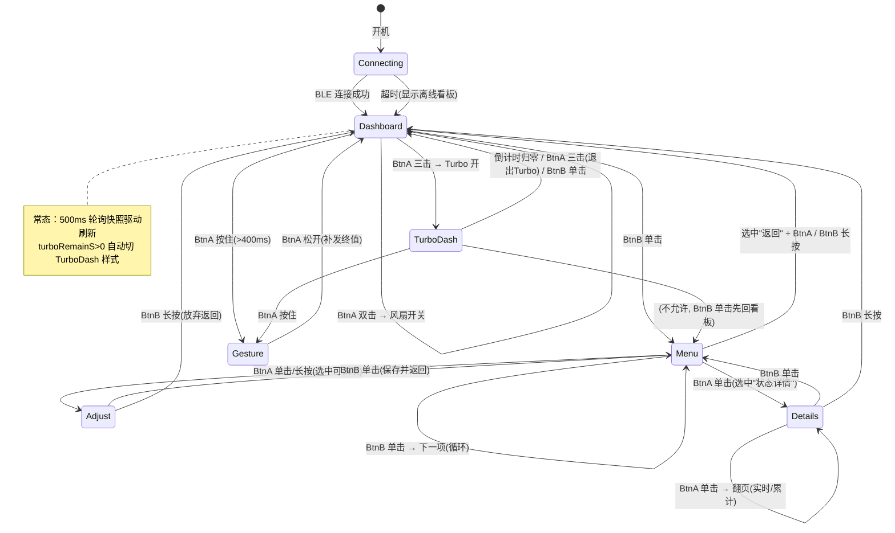

# StickS3 风扇遥控器 · 交互设计稿

> 状态：**设计冻结，待硬件到货实施**。协议层（`src/w96p_protocol.*`）与 client 层（`src/w96p_client.*`）已完成且本设计不需要它们变更；本文档只涉及 UI/交互层。
>
> 硬件输入盘点（KB 核实）：BtnA=G11（正面）、BtnB=G12（侧面）、BMI270 IMU、135×240 屏幕、BLE（client 已就绪）。

---

## 1. 设计原则

- **侧键导航，正键动作**：BtnB（侧面，拇指）管界面跳转；BtnA（正面，食指）管数值/开关。
- **看板优先**：默认界面是只读状态看板，所有控制都要"多走一步"，杜绝误触。
- **手势是特权模式**：必须按住 BtnA 才生效，松开即退出（dead-man switch）。
- **连击语义互斥**：双击/三击用 `wasDeciedClickCount`（等序列超时确认），双击只在恰好两下时触发，三击只在恰好三下时触发，互不污染。
- **数据采信两原则**（用户裁定，违反即设计错误）：
  1. **设备可换电池，且当前固件未实现电池记账** → `capacityMwh/rcapMwh/chgMwh/dchgMwh/chgTimeS/dchgTimeS` 只返回占位数据（固件根本没做，非"不准"是"没有"）。界面只呈现**电压与电流**。
  2. **不做电量推算** → 用户群体看得懂锂电池电压；且设备全功率工作有最高 0.1V 负载压降，任何电压法 SOC 推算都不可信，**不做、不显示**。
  3. **设备无温度传感器** → `tempC`（FFD1）与 `coreTemp`（FFD4）均来自电源管理芯片，不是电池温度，**不采信、不呈现**。

## 2. 状态机



## 3. 完整操作路径（功能 → 到达方式）

| 功能 | 路径 | client API |
|---|---|---|
| 风扇开/关 | 看板 · BtnA 双击 | `setPower(0/1)` |
| Turbo 开/提前退出 | 看板 · BtnA 三击 | `setTurbo(bool)` |
| 无级调速 | 看板 · BtnA 按住 → 上举/下摆 → 松开 | `setSpeed(pct)` |
| 升档/降档 | 看板 · BtnA 按住 → 右摇/左摇 | `setPower(gear±1)` |
| 风速微调 | 菜单 → 风速 → BtnA 短按 -5% / 长按 +5% → BtnB 保存 | `setSpeed(pct)` |
| 定时关机 | 菜单 → 定时 → BtnA 短按 -30min / 长按 +30min（0=取消）→ BtnB 保存 | `setTimerMinutes(min)` |
| 自然风 | 菜单 → 自然风 → BtnA 短按切换 → BtnB 保存 | `setNatureWind(bool)` |
| Turbo 倒计时查看 | 看板自动（turboRemainS>0 时看板变倒计时样式） | 快照字段 |
| 灯光档位 | 菜单 → 灯光 → BtnA 短按循环 0-4 → BtnB 保存 | `setLight(lv)` |
| 查看电池/电机/VBUS 摘要 | 看板常驻显示 | 快照字段 |
| 查看全部状态详情 | 菜单 → 状态详情（两页：实时/累计，BtnA 翻页） | 快照 + `readPowerConfig` |
| 重连 | 掉线自动重扫（client 已实现 onConn(false) → startScan） | 自动 |

**菜单项定义**（循环顺序）：`风速 → 定时 → 自然风 → Turbo → 灯光 → 状态详情 → 返回`

## 4. 手势模式设计（v2：双通道）

手势模式内（按住 BtnA）同时开放两条控制通道。**所有方向判定都在体感参考系中进行，不用设备绝对 XYZ**——校准见 §4.0：

| 手势 | 信号性质 | 检测路径 | 动作 |
|---|---|---|---|
| 左摇 / 右摇 | 体感 right 轴 accel 瞬态脉冲（高频） | 基线差 + 峰值检测 | 降档 / 升档（`setPower(gear∓1)`，1-4 钳位） |
| 上举 / 下摆 | 体感俯仰稳态变化（低频） | 重力投影差 + EMA 低通 + 速率映射 | 风速无级爬升/下降（`setSpeed`） |

### 4.0 体感参考系校准（进入手势瞬间）

方向取决于**抓握姿势**而非设备绝对轴向。用进入瞬间的重力向量建系：

```
g0    = 进入时 accel 滑动均值（设备系下的重力向量，定义体感"下"）
L     = 设备长轴在设备系中的方向（硬件固定，真机一次性标定）
down  = g0 / |g0|
right = normalize(cross(L, down))   // 体感"右"
fwd   = cross(down, right)          // 体感"前"
```

性质：设备倒置（旋转 180°）时 g0 翻转 → right 自动翻转，**方向语义跟着手走**。
退化情形：设备完全竖直握持（L ∥ down）时 cross 无定义 → 沿用上一次的基；首次使用则屏幕提示"请稍倾斜握持"。

判读规则：

- **摇**：瞬态 accel `a_hp`，取 `s = a_hp · right`；要求 right 分量占优（|s| > |a_hp·fwd| 且 > |a_hp·down|），符号定左/右。
- **举/摆**：`Δg = g_now - g0`（g_now 为低通后的当前重力），俯仰量度 `p = Δg · fwd`，上举为正。

```mermaid
flowchart LR
    A[BtnA 按住 >400ms] --> B[进入手势模式<br/>记录中性姿态 N + accel 基线]
    B --> F[30Hz+ 采样循环]
    F --> G{信号分离}
    G -->|高通: ax-基线| H{峰值检测<br/>|Δax|>2.5 m/s²?}
    H -->|首峰为负| I[左摇 → 降档]
    H -->|首峰为正| J[右摇 → 升档]
    I --> K[400ms 防连发]
    J --> K
    K --> F
    G -->|低通 EMA α=0.3| L[pitch 相对角 Δθ]
    L --> M{±8° 死区}
    M -->|上举 Δθ>0| N[speed += rate·Δt]
    M -->|下摆 Δθ<0| O[speed -= rate·Δt]
    N --> P[150ms 节流写 setSpeed]
    O --> P
    P --> F
    F --> Q{BtnA 松开?}
    Q -->|是| R[补发终值<br/>退出回看板]
```

### 4.1 摇（离散档位）

- **检测**：瞬态 accel 在体感 right 轴的投影 `s`，|s| >2.5 m/s² 且 250ms 内回落到 0.8 m/s² 以下 = 一次有效摇；方向取 s 的符号。
- **防连发**：触发后 400ms refractory，期间忽略一切峰值。
- **边界**：1 档再左摇 / 4 档再右摇 → 屏幕闪一下提示，不下发。
- **陀螺辅助（可选）**：角速度在 right 轴投影同号确认可降低误检，原型期先纯 accel，误检率高再加。
- 阈值全部留成常量，真机调（第一次烧录带调试打印）。

### 4.2 举/摆（连续风速，速率模式）

- **不用绝对映射**（角度→%），用**速率模式**：`rate = (p/45°) × 30%/s`（p 为体感俯仰量度），即满倾时风速每秒变 30%，从 0 到 100% 约 3.3s；小角度 = 微调。
- ±8° 等效死区防抖；松手时风扇保持当前值。
- BLE 写节流不变：变化 ≥2% 且 ≥150ms；松手补终值。
- **gear 与 speed 的语义关系**：风扇固件里换挡会把转速设为该档校准值（FFF7），之后 PWM 微调覆盖当前档转速——手势里两者独立下发即可，无需同步。

### 4.3 原 v1 设计保留项

- ~~自适应锁轴~~ → 已被体感参考系取代（更通用，且天然处理斜握）。
- 不融合陀螺仪做姿态解算：摇/举检测都基于重力与瞬态加速度投影，静态场景陀螺积分只引入漂移（§4.1 的陀螺辅助仅作瞬时符号确认，不积分）。
- 关机状态调速固件自动先开 1 档（协议 §8.9）；自然风互斥 client 层已处理。
- 屏幕实时大字号显示 + 调试信息（原型期）。

## 5. UI 草案（135×240 竖屏，setRotation(0)，size1 字体 6×8 ≈ 22 列）

### 5.0 配色规范（全界面统一语义）

颜色是信息通道，不是装饰。全部界面只用这一套语义（RGB565，M5GFX 常量/自定义）：

| 颜色 | 语义 | 用例 |
|---|---|---|
| **绿** `0x07E0` | 正常/在线/开启 | BLE 在线点、开关量 ON、充电中 |
| **深灰** `0x4208` | 关闭/无数据/提示 | off 值、"--"、底部按键提示、分隔线 |
| **青** `0x07FF` | 可调值/强调 | 风速数字、进度条、菜单当前值 |
| **橙** `0xFD20` | 警告/高能状态 | Turbo 激活、电池 <30%、手势摇档提示 |
| **红** `0xF800` | 报警/错误 | 电机堵转 BLOCK、电池 <10%、BLE 掉线、手势到头闪屏 |
| **白** `0xFFFF` | 常规数值正文 | 一般数据 |

具体落点：

- **BLE 状态点**：在线绿 ● / 离线红 ○（全局第一行，所有界面一致）
- **风速大字与进度条**：青色；自然风开启时进度条变绿（模式提示）
- **电池行**：按裸电压着色——<3.5V 橙、<3.3V 红（不做 SOC 换算）；充电中电流值变绿
- **电机堵转**：`BLOCK!` 红字反白（fillRect 红底）
- **Turbo 看板**：标题橙底黑字条，倒计时橙色，进度条橙色
- **菜单**：光标行反白（白底黑字），当前值青色，不可调项（状态详情/返回）标题深灰
- **手势模式**：左摇闪橙、右摇闪青（150ms 色块），到头闪红；调速数字青色
- **详情页**：分隔线深灰，页标题青，告警值（高温 >60°C）橙
- **全局底色黑**：LCD 黑底功耗与背光无关，但黑底对比度最好，阳光下可读性最优

### 5.1 状态看板（默认 / 离线）

```
┌──────────────────────┐
│ W96P          ● BLE  │  ●绿=在线 ○灰=离线
│                      │
│        65 %          │  大字号当前风速(size3)
│ ▓▓▓▓▓▓▓▓▓▓▓░░░░░░░  │  进度条
│                      │
│ NAT:off   TMR: --    │
│ LGT:4     GEA: --    │
│                      │
│ BAT 3.95V  -412mA    │
│ MOT  320mA   ok      │
│ BUS 5.02V    DCHG    │
│                      │
│ A hold:手势 2x:开关  │
│ 3x:Turbo   B:菜单    │
└──────────────────────┘
```

### 5.2 Turbo 看板（turboRemainS > 0 自动切换）

```
┌──────────────────────┐
│ ** TURBO **   ● BLE  │
│                      │
│       02:47          │  大字号倒计时(size3)
│ ▓▓▓▓▓▓▓▓▓▓▓▓▓▓░░░░░  │  剩余比例条(总长=turboTime)
│                      │
│ BAT 3.90V  -980mA    │
│ MOT  810mA   5.1V    │
│                      │
│ 3xA:退出Turbo        │
└──────────────────────┘
```

### 5.3 高级菜单（BtnB 遍历，">" 为光标）

```
┌──────────────────────┐
│ MENU            2/6  │
│                      │
│   风速         65%   │
│ > 定时         off   │
│   自然风       off   │
│   Turbo        off   │
│   灯光          4    │
│ > 状态详情           │
│   返回               │
│                      │
│ A:调节  B:下一项     │
│ B长按:回看板         │
└──────────────────────┘
```

### 5.4 调节态（以"定时"为例）

```
┌──────────────────────┐
│ 定时关机             │
│                      │
│       60 min         │  大字号(size2)
│                      │
│ A短按:-30   A长按:+30│
│ 0 = 取消定时         │
│                      │
│ B:保存返回  B长按:放弃│
└──────────────────────┘
```

### 5.6 状态详情 · 第 1 页（实时）

```
┌──────────────────────┐
│ STATUS 实时     1/2  │
│ SPD  65%   GEA --    │
│ NAT  off   TUR --    │
│ TMR  --    LGT 4     │
│ ──────────────────   │
│ BAT 3.95V  -412mA    │
│ ──────────────────   │
│ MOT 320mA  5.1V ok   │
│ BUS 5.02V  1.2A      │
│ POW in-C   DCHG      │
│ C.out ON C.in ON     │
│ HV   ON              │
│                      │
│ A:翻页  B:返回菜单   │
└──────────────────────┘
```

### 5.7 状态详情 · 第 2 页（累计/设备）

```
┌──────────────────────┐
│ STATUS 设备     2/2  │
│ DEV W96P  BLE -58dB  │
│ MAC aa:bb:cc:dd:ee   │
│ FW  v1.7 (powVer 17) │
│ sink PD  src QC3.0   │
│ powLevel 3 [未确认]  │
│                      │
│ A:翻页  B:返回菜单   │
└──────────────────────┘
```

说明：进入详情页时做一次 `readPowerConfig`（阻塞读）补齐固件版本/快充协议；`powLevel`（FFD4 偏移 0，"电量等级"）刻度语义协议未写，真机读值对照后再决定是否采信。电池累计统计（chgMwh/dchgMwh/时长）与温度按采信原则全部不显示。两页均随 500ms 快照刷新。

### 5.5 手势模式

```
┌──────────────────────┐
│ GESTURE      ● BLE   │
│                      │
│        42 %          │  大字号实时值(size4)
│ ▓▓▓▓▓▓▓░░░░░░░░░░░  │
│                      │
│ gear: 2   Δθ: -12°   │  调试信息(原型期保留)
│                      │
│ 摇:换档  举/摆:调速  │
│ 松开 BtnA 确认       │
└──────────────────────┘
```

## 6. 伪代码

```cpp
// ===== 状态与数据 =====
enum Screen { CONNECTING, DASHBOARD, MENU, ADJUST, GESTURE, TURBO_DASH, DETAILS };
Screen scr = CONNECTING;
int detailsPage = 0;        // 0=实时 1=累计
PowerConfig powCfg;         // 进详情页时读一次

Snapshot snap;              // client 轮询快照（500ms）
bool    online = false;

// 菜单
struct MenuItem { const char* name; enum { PERCENT, MINUTES, TOGGLE, LIGHT, BACK } type; };
MenuItem menu[7] = { {"风速",PERCENT}, {"定时",MINUTES}, {"自然风",TOGGLE},
                     {"Turbo",TOGGLE}, {"灯光",LIGHT}, {"状态详情",VIEW}, {"返回",BACK} };
int menuIdx = 0;
int adjustVal;              // 调节态暂存值（保存才下发）

// 手势（v2：体感参考系双通道）
struct Vec3 { float x, y, z; };
struct {
    Vec3 g0, right, fwd;       // 进入时建立的体感基
    float emaP;                // 俯仰量度 EMA
    float speedF;              // 速率模式浮点风速
    uint32_t shakeLockMs;
    uint8_t lastSent; uint32_t lastSentMs;
} g;

// ===== 手势 =====
Vec3 dot_basis(Vec3 v);  // 返回 {v·right, v·fwd, v·down}，down = g0 归一化

void enterGesture() {
    g.g0 = avgAccel(100ms);              // 重力向量 = 体感"下"
    Vec3 down = normalize(g.g0);
    Vec3 L = deviceLongAxis();           // 真机标定的常量
    if (fabs(dot(L, down)) > 0.95) {     // 竖直握持退化
        if (!hasLastBasis()) { showHint("请稍倾斜握持"); return; }
        restoreLastBasis();
    } else {
        g.right = normalize(cross(L, down));
        g.fwd   = cross(down, g.right);
    }
    g.emaP = 0; g.speedF = snap.speed;
    g.shakeLockMs = 0;
    g.lastSent = snap.speed; g.lastSentMs = 0;
    scr = GESTURE;
}

void gestureTick() {                      // loop 频率 ≳30Hz
    Vec3 a = M5.Imu.getImuData().accel;
    uint32_t now = millis();
    Vec3 s = dot_basis(a);                // 体感系投影

    // --- 通道1：摇（离散档位，体感 right）---
    float hp = s.x - 0;                   // right 轴无重力分量，近似高通
    if (now > g.shakeLockMs && fabs(hp) > 2.5f
        && fabs(hp) > fabs(s.y) && fabs(hp) > fabs(s.z)) {  // right 占优
        int gear = currentGear();
        int next = constrain(gear + (hp > 0 ? 1 : -1), 1, 4);
        if (next != gear) { cli.setPower(next); flashGear(next); }
        else flashEdge();
        g.shakeLockMs = now + 400;
    }

    // --- 通道2：举/摆（速率模式，体感俯仰）---
    Vec3 dg = dot_basis(lowpass(a));      // 当前重力在体感系中的位置
    float p = dg.y - dot_basis(g.g0).y;   // fwd 分量差 ≈ 俯仰量度
    g.emaP += 0.3f * (p - g.emaP);
    if (fabs(g.emaP) > deadzone8deg) {
        float rate = (g.emaP / deg45) * 30.0f;   // %/s
        g.speedF = constrain(g.speedF + rate * dt(), 0.0f, 100.0f);
        uint8_t pct = uint8_t(g.speedF + 0.5f);
        if (abs(pct - g.lastSent) >= 2 && now - g.lastSentMs >= 150) {
            cli.setSpeed(pct);
            g.lastSent = pct; g.lastSentMs = now;
        }
    }
    if (M5.BtnA.wasReleased()) { cli.setSpeed(g.lastSent); scr = DASHBOARD; }
}

// ===== 主循环 =====
void loop() {
    M5.update();            // 铁律：按键/IMU 数据刷新
    cli.update();           // BLE 队列 + 轮询

    dispatchButtons();
    if (scr == GESTURE) gestureTick();
    if (snap.turboRemainS > 0 && scr == DASHBOARD) scr = TURBO_DASH;
    if (snap.turboRemainS == 0 && scr == TURBO_DASH) scr = DASHBOARD;
    render();               // 按 scr 重绘（脏标记节流）
}

// ===== 按键分发 =====
void dispatchButtons() {
    switch (scr) {
    case DASHBOARD:
    case TURBO_DASH: {
        uint8_t clicks = M5.BtnA.wasDeciedClickCount(0) ? 0 : decidedCount(M5.BtnA);
        if (clicks == 2) cli.setPower(fanIsOn() ? 0 : 1);
        if (clicks == 3) cli.setTurbo(snap.turboRemainS == 0);
        if (M5.BtnA.pressedFor(400)) enterGesture();   // 按住进手势
        if (M5.BtnB.wasClicked())  scr = (scr == TURBO_DASH) ? DASHBOARD : MENU;
        break;
    }
    case MENU:
        if (M5.BtnB.wasClicked()) menuIdx = (menuIdx + 1) % 7;
        if (M5.BtnB.pressedFor(800)) scr = DASHBOARD;
        if (M5.BtnA.wasClicked() || M5.BtnA.wasHold()) {
            if (menu[menuIdx].type == BACK) scr = DASHBOARD;
            else if (menu[menuIdx].type == VIEW) {
                cli.readPowerConfig(powCfg);   // 阻塞读一次，补齐 FW/快充信息
                detailsPage = 0; scr = DETAILS;
            }
            else { adjustVal = currentValOf(menuIdx); scr = ADJUST; }
        }
        break;
    case DETAILS:
        if (M5.BtnA.wasClicked()) detailsPage ^= 1;              // 翻页
        if (M5.BtnB.wasClicked()) scr = MENU;
        if (M5.BtnB.pressedFor(800)) scr = DASHBOARD;
        break;
    case ADJUST:
        if (M5.BtnA.wasClicked()) adjustVal = stepDown(menu[menuIdx].type, adjustVal);
        if (M5.BtnA.wasHold())    adjustVal = stepUp  (menu[menuIdx].type, adjustVal);
        if (M5.BtnB.wasClicked()) { commit(menuIdx, adjustVal); scr = MENU; }   // 保存
        if (M5.BtnB.pressedFor(800)) scr = DASHBOARD;                            // 放弃
        break;
    case GESTURE:
        if (M5.BtnA.wasReleased()) { cli.setSpeed(g.lastSent); scr = DASHBOARD; } // 补终值退出
        break;
    }
}

// ===== 手势（v2 双通道）=====
void enterGesture() {
    auto d = M5.Imu.getImuData();
    g.neutralPitch = pitchOf(d);
    g.baseAx = lateralAx(d);         // 横向分量基线
    g.ema = 0; g.speedF = snap.speed;
    g.shakeLockMs = 0;
    g.lastSent = snap.speed; g.lastSentMs = 0;
    scr = GESTURE;
}
void gestureTick() {                          // loop 频率 ≳30Hz
    auto d = M5.Imu.getImuData();
    uint32_t now = millis();

    // --- 通道1：摇（离散档位）---
    float ax = lateralAx(d) - g.baseAx;       // 高通近似
    if (now > g.shakeLockMs && fabs(ax) > 2.5f) {
        int gear = currentGear();
        int next = constrain(gear + (ax > 0 ? 1 : -1), 1, 4);
        if (next != gear) { cli.setPower(next); flashGear(next); }
        else flashEdge();                     // 到头提示
        g.shakeLockMs = now + 400;            // refractory
    }

    // --- 通道2：举/摆（速率模式调速）---
    float dP = pitchOf(d) - g.neutralPitch;
    g.ema += 0.3f * (dP - g.ema);             // EMA 低通
    if (fabs(g.ema) > 8.0f) {                 // 死区
        float rate = (g.ema / 45.0f) * 30.0f; // %/s
        g.speedF = constrain(g.speedF + rate * dt(), 0.0f, 100.0f);
        uint8_t pct = uint8_t(g.speedF + 0.5f);
        if (abs(pct - g.lastSent) >= 2 && now - g.lastSentMs >= 150) {
            cli.setSpeed(pct);                // 节流写
            g.lastSent = pct; g.lastSentMs = now;
        }
    }
    if (M5.BtnA.wasReleased()) { cli.setSpeed(g.lastSent); scr = DASHBOARD; }
}

// ===== 渲染（全部走 M5.Display，不实例化 M5GFX）=====
void render() { /* 按 scr 分派五个界面；数值变化才重绘对应区域 */ }
```

## 7. 实施注意（动工前重读）

1. **连击判定延迟**：`wasDeciedClickCount` 需等序列超时（≈400ms），三击总响应 ~1s，属正常，别当 bug。
2. **M5.update() 必须每轮 loop 调用**，否则按键/IMU 静默失效（KB 铁律 #5）。
3. **IMU 轴向与设备长轴 L 未在真机核实**：`deviceLongAxis()` 常量与 BMI270 轴向图对照后真机打印标定，第一次烧录先做校准打印。
4. **调节步长**：风速 ±5%、定时 ±30min（0=取消，上限 480）、灯光 0-4 循环。
5. **Turbo 看板计时条总长**：需要 turboTime（FFF8），原型期可先用 199s 默认值，后续加一次连接后读取。
6. **功耗**：遥控器场景后续可接 M5PM1 电源档（翻面朝下→L1 值守，拿起 IMU 唤醒），属二期，不影响本设计。
7. **电量**：不做任何 SOC 推算（0.1V 负载压降使电压法失真），只显示裸电压/电流；SDK 自学习算法不移植。
8. **client 层无需任何改动**——本设计全部基于已完成的 API（`setPower/setSpeed/setTimerMinutes/setNatureWind/setTurbo/setLight` + 快照字段）。
