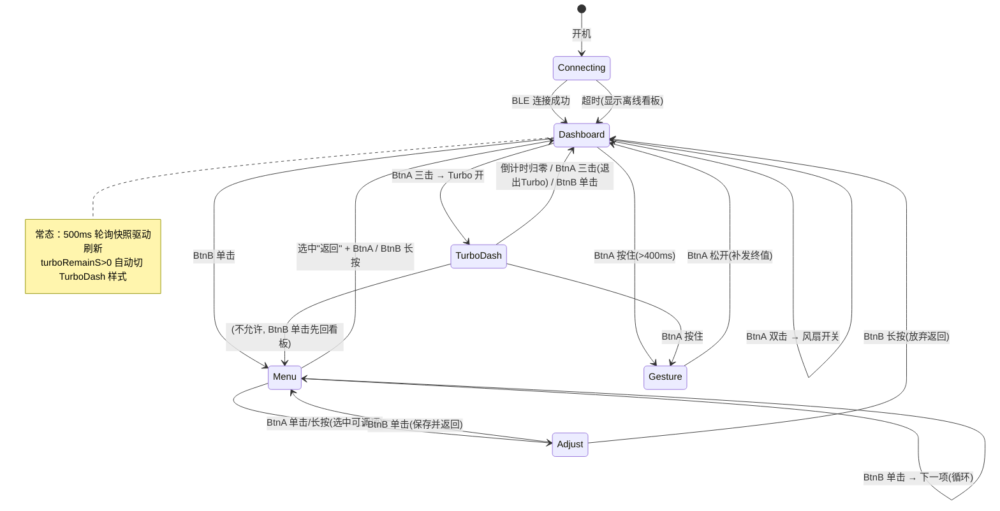
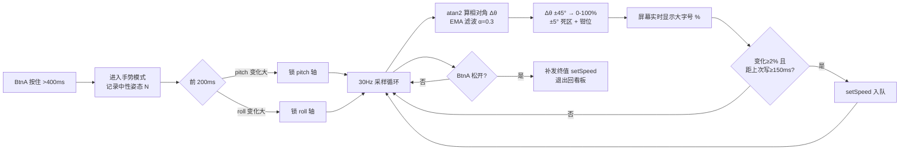

# StickS3 风扇遥控器 · 交互设计稿

> 状态：**设计冻结，待硬件到货实施**。协议层（`src/w96p_protocol.*`）与 client 层（`src/w96p_client.*`）已完成且本设计不需要它们变更；本文档只涉及 UI/交互层。
>
> 硬件输入盘点（KB 核实）：BtnA=G11（正面）、BtnB=G12（侧面）、BMI270 IMU、135×240 屏幕、BLE（client 已就绪）。

---

## 1. 设计原则

- **侧键导航，正键动作**：BtnB（侧面，拇指）管界面跳转；BtnA（正面，食指）管数值/开关。
- **看板优先**：默认界面是只读状态看板，所有控制都要"多走一步"，杜绝误触。
- **手势是特权模式**：必须按住 BtnA 才生效，松开即退出（dead-man switch）。
- **连击语义互斥**：双击/三击用 `wasDeciedClickCount`（等序列超时确认），双击只在恰好两下时触发，三击只在恰好三下时触发，互不污染。

## 2. 状态机



## 3. 完整操作路径（功能 → 到达方式）

| 功能 | 路径 | client API |
|---|---|---|
| 风扇开/关 | 看板 · BtnA 双击 | `setPower(0/1)` |
| Turbo 开/提前退出 | 看板 · BtnA 三击 | `setTurbo(bool)` |
| 无级调速 | 看板 · BtnA 按住 → 倾斜 → 松开 | `setSpeed(pct)` |
| 风速微调 | 菜单 → 风速 → BtnA 短按 -5% / 长按 +5% → BtnB 保存 | `setSpeed(pct)` |
| 定时关机 | 菜单 → 定时 → BtnA 短按 -30min / 长按 +30min（0=取消）→ BtnB 保存 | `setTimerMinutes(min)` |
| 自然风 | 菜单 → 自然风 → BtnA 短按切换 → BtnB 保存 | `setNatureWind(bool)` |
| Turbo 倒计时查看 | 看板自动（turboRemainS>0 时看板变倒计时样式） | 快照字段 |
| 灯光档位 | 菜单 → 灯光 → BtnA 短按循环 0-4 → BtnB 保存 | `setLight(lv)` |
| 查看电池/电机/VBUS | 看板常驻显示 | 快照字段 |
| 重连 | 掉线自动重扫（client 已实现 onConn(false) → startScan） | 自动 |

**菜单项定义**（循环顺序）：`风速 → 定时 → 自然风 → Turbo → 灯光 → 返回`

## 4. 手势模式设计



要点：

1. **进入即校准**：中性点 = 进入瞬间姿态，不假设握姿。
2. **自适应轴**：pitch/roll 谁变化大锁谁，两种转腕习惯通吃。角速度只用加速度计重力分量（`atan2`），不融合陀螺仪——静止调速场景陀螺仪只会引入漂移。
3. **写节制**：本地显示零延迟，BLE 写入节流（≥2% 且 ≥150ms），松手补终值。风扇只认最后一锤子。
4. **关机状态调速**：风扇固件自动先开 1 档再调速（协议 §8.9），UI 无需特判。
5. **自然风互斥**：client 层已实现（先写 NATURE_WIND=00，隔 100ms 再写转速），UI 只需在 natureOn 时给个提示。

## 5. UI 草案（135×240 竖屏，setRotation(0)，size1 字体 6×8 ≈ 22 列）

### 5.1 状态看板（默认 / 离线）

```
┌──────────────────────┐
│ W96P          ● BLE  │  ●绿=在线 ○灰=离线
│                      │
│        65 %          │  大字号当前风速(size3)
│ ▓▓▓▓▓▓▓▓▓▓▓░░░░░░░  │  进度条
│                      │
│ NAT:off   TMR: --    │
│ LGT:4     GEA: --    │
│                      │
│ BAT 3.95V  -412mA    │
│ REM 12000mWh   38°C  │
│ MOT  320mA   ok      │
│ BUS 5.02V    DCHG    │
│                      │
│ A hold:手势 2x:开关  │
│ 3x:Turbo   B:菜单    │
└──────────────────────┘
```

### 5.2 Turbo 看板（turboRemainS > 0 自动切换）

```
┌──────────────────────┐
│ ** TURBO **   ● BLE  │
│                      │
│       02:47          │  大字号倒计时(size3)
│ ▓▓▓▓▓▓▓▓▓▓▓▓▓▓░░░░░  │  剩余比例条(总长=turboTime)
│                      │
│ BAT 3.90V  -980mA    │
│ MOT  810mA   5.1V    │
│                      │
│ 3xA:退出Turbo        │
└──────────────────────┘
```

### 5.3 高级菜单（BtnB 遍历，">" 为光标）

```
┌──────────────────────┐
│ MENU            2/6  │
│                      │
│   风速         65%   │
│ > 定时         off   │
│   自然风       off   │
│   Turbo        off   │
│   灯光          4    │
│   返回               │
│                      │
│ A:调节  B:下一项     │
│ B长按:回看板         │
└──────────────────────┘
```

### 5.4 调节态（以"定时"为例）

```
┌──────────────────────┐
│ 定时关机             │
│                      │
│       60 min         │  大字号(size2)
│                      │
│ A短按:-30   A长按:+30│
│ 0 = 取消定时         │
│                      │
│ B:保存返回  B长按:放弃│
└──────────────────────┘
```

### 5.5 手势模式

```
┌──────────────────────┐
│ GESTURE      ● BLE   │
│                      │
│        42 %          │  大字号实时值(size4)
│ ▓▓▓▓▓▓▓░░░░░░░░░░░  │
│                      │
│ tilt: -12°  [roll]   │  调试信息(原型期保留)
│                      │
│ 倾斜调速             │
│ 松开 BtnA 确认       │
└──────────────────────┘
```

## 6. 伪代码

```cpp
// ===== 状态与数据 =====
enum Screen { CONNECTING, DASHBOARD, MENU, ADJUST, GESTURE, TURBO_DASH };
Screen scr = CONNECTING;

Snapshot snap;              // client 轮询快照（500ms）
bool    online = false;

// 菜单
struct MenuItem { const char* name; enum { PERCENT, MINUTES, TOGGLE, LIGHT, BACK } type; };
MenuItem menu[6] = { {"风速",PERCENT}, {"定时",MINUTES}, {"自然风",TOGGLE},
                     {"Turbo",TOGGLE}, {"灯光",LIGHT}, {"返回",BACK} };
int menuIdx = 0;
int adjustVal;              // 调节态暂存值（保存才下发）

// 手势
struct { float neutralPitch, neutralRoll; int axis; float ema;
         uint8_t lastSent; uint32_t lastSentMs; } g;

// ===== 主循环 =====
void loop() {
    M5.update();            // 铁律：按键/IMU 数据刷新
    cli.update();           // BLE 队列 + 轮询

    dispatchButtons();
    if (scr == GESTURE) gestureTick();
    if (snap.turboRemainS > 0 && scr == DASHBOARD) scr = TURBO_DASH;
    if (snap.turboRemainS == 0 && scr == TURBO_DASH) scr = DASHBOARD;
    render();               // 按 scr 重绘（脏标记节流）
}

// ===== 按键分发 =====
void dispatchButtons() {
    switch (scr) {
    case DASHBOARD:
    case TURBO_DASH: {
        uint8_t clicks = M5.BtnA.wasDeciedClickCount(0) ? 0 : decidedCount(M5.BtnA);
        if (clicks == 2) cli.setPower(fanIsOn() ? 0 : 1);
        if (clicks == 3) cli.setTurbo(snap.turboRemainS == 0);
        if (M5.BtnA.pressedFor(400)) enterGesture();   // 按住进手势
        if (M5.BtnB.wasClicked())  scr = (scr == TURBO_DASH) ? DASHBOARD : MENU;
        break;
    }
    case MENU:
        if (M5.BtnB.wasClicked()) menuIdx = (menuIdx + 1) % 6;
        if (M5.BtnB.pressedFor(800)) scr = DASHBOARD;
        if (M5.BtnA.wasClicked() || M5.BtnA.wasHold()) {
            if (menu[menuIdx].type == BACK) scr = DASHBOARD;
            else { adjustVal = currentValOf(menuIdx); scr = ADJUST; }
        }
        break;
    case ADJUST:
        if (M5.BtnA.wasClicked()) adjustVal = stepDown(menu[menuIdx].type, adjustVal);
        if (M5.BtnA.wasHold())    adjustVal = stepUp  (menu[menuIdx].type, adjustVal);
        if (M5.BtnB.wasClicked()) { commit(menuIdx, adjustVal); scr = MENU; }   // 保存
        if (M5.BtnB.pressedFor(800)) scr = DASHBOARD;                            // 放弃
        break;
    case GESTURE:
        if (M5.BtnA.wasReleased()) { cli.setSpeed(g.lastSent); scr = DASHBOARD; } // 补终值退出
        break;
    }
}

// ===== 手势 =====
void enterGesture() {
    auto d = M5.Imu.getImuData();
    g.neutralPitch = pitchOf(d); g.neutralRoll = rollOf(d);
    g.axis = -1; g.ema = 0; g.lastSent = snap.speed; g.lastSentMs = 0;
    scr = GESTURE;
}
void gestureTick() {                        // loop 频率 ≳30Hz 即可
    auto d = M5.Imu.getImuData();
    float dP = pitchOf(d) - g.neutralPitch;
    float dR = rollOf(d)  - g.neutralRoll;
    if (g.axis < 0 && millis() - enterMs > 200)
        g.axis = fabs(dP) > fabs(dR) ? 0 : 1;   // 自适应锁轴
    float ang = g.axis == 0 ? dP : dR;
    g.ema += 0.3f * (ang - g.ema);              // EMA 滤波
    if (fabs(g.ema) < 5) return;                // 死区
    int pct = clamp(int((g.ema + 45) * 100 / 90), 0, 100);
    if (abs(pct - g.lastSent) >= 2 && millis() - g.lastSentMs >= 150) {
        cli.setSpeed(pct);                      // 节流写
        g.lastSent = pct; g.lastSentMs = millis();
    }
}

// ===== 渲染（全部走 M5.Display，不实例化 M5GFX）=====
void render() { /* 按 scr 分派五个界面；数值变化才重绘对应区域 */ }
```

## 7. 实施注意（动工前重读）

1. **连击判定延迟**：`wasDeciedClickCount` 需等序列超时（≈400ms），三击总响应 ~1s，属正常，别当 bug。
2. **M5.update() 必须每轮 loop 调用**，否则按键/IMU 静默失效（KB 铁律 #5）。
3. **IMU 轴向未在真机核实**：`pitchOf/rollOf` 用哪个加速度分量，以 KB 中 BMI270 轴向图 + 真机打印为准，第一次烧录先做轴向校准打印。
4. **调节步长**：风速 ±5%、定时 ±30min（0=取消，上限 480）、灯光 0-4 循环。
5. **Turbo 看板计时条总长**：需要 turboTime（FFF8），原型期可先用 199s 默认值，后续加一次连接后读取。
6. **功耗**：遥控器场景后续可接 M5PM1 电源档（翻面朝下→L1 值守，拿起 IMU 唤醒），属二期，不影响本设计。
7. **client 层无需任何改动**——本设计全部基于已完成的 API（`setPower/setSpeed/setTimerMinutes/setNatureWind/setTurbo/setLight` + 快照字段）。
